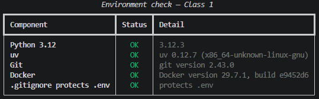

## Clase 2 — APIs de IA Generativa y memoria conversacional

Script principal: `conversation.py`. Modelo: `gemini-3.5-flash-lite`.
La API key se lee con `os.environ["GEMINI_API_KEY"]` desde un `.env` que está
en `.gitignore` y no se versiona.

### Conversación de 8 turnos (Paso 7)

Ver evidencia en `entregas/s02/evidencia/memoria.txt`.

El dato personal se entrega en el turno 1 y se pregunta de vuelta en el turno 8.
El modelo responde correctamente porque en cada llamada se reenvía el historial
completo: la API es *stateless* y no recuerda nada por su cuenta.

Observa el contador `[tokens]`: el `prompt` crece de 25 a 496 tokens a lo largo
de la conversación, aunque las preguntas son igual de cortas. Ese crecimiento es
el costo real de la memoria — cada turno vuelve a pagar por todo lo anterior.

```
===== TURNO 1 de 8 =====
USUARIO: Me llamo Alex y mi color favorito es el verde.
[tokens] total=63 (prompt=25, respuesta=38)
BOT    : ¡Hola, Alex! Encantado de conocerte y de saber que tu color favorito es el verde, ¡un color muy fresco y natural! ¿En qué te puedo ayudar hoy?
[history: 2 entradas]

===== TURNO 2 de 8 =====
USUARIO: ¿Qué framework de Python vimos en la Clase 1?
[tokens] total=128 (prompt=77, respuesta=51)
BOT    : Como soy un asistente de IA, no tengo acceso al historial específico de tus clases presenciales o cursos particulares. Si me dices de qué curso o temática se trata, con gusto te digo qué frameworks de Python suelen verse al inicio (como Flask o FastAPI).
[history: 4 entradas]

===== TURNO 3 de 8 =====
USUARIO: Dame un ejemplo de dato que no cabe en un int.
[tokens] total=284 (prompt=142, respuesta=142)
BOT    : Un ejemplo en Python es cualquier número entero mayor que $9,223,372,036,854,775,807$ (en lenguajes como C o Java, el límite tradicional de un `int` de 64 bits). 

Por ejemplo:
`999999999999999999999999999`

*(Nota: En Python 3 los enteros tienen precisión arbitraria y crecen según la memoria disponible, pero en lenguajes como C/C++ o Java, este número desbordaría un `int` estándar).*
[history: 6 entradas]

===== TURNO 4 de 8 =====
USUARIO: ¿Qué hace el comando uv init?
[tokens] total=365 (prompt=294, respuesta=71)
BOT    : El comando `uv init` (de la herramienta `uv` de Astral para Python) inicializa un nuevo proyecto. 

Crea la estructura básica, incluyendo:
* Un archivo `pyproject.toml` (configuración del proyecto).
* Un archivo `main.py` de ejemplo.
* Un entorno virtual (`.venv`).
[history: 8 entradas]

===== TURNO 5 de 8 =====
USUARIO: Explica en una frase qué es un token.
[tokens] total=405 (prompt=377, respuesta=28)
BOT    : Un token es una unidad básica de texto (como una palabra o parte de ella) que los modelos de lenguaje procesan y entienden.
[history: 10 entradas]

===== TURNO 6 de 8 =====
USUARIO: ¿Qué significa que una API sea stateless?
[tokens] total=448 (prompt=416, respuesta=32)
BOT    : Significa que el servidor no guarda información sobre el estado del cliente entre una petición y otra; cada solicitud debe contener toda la información necesaria para ser procesada.
[history: 12 entradas]

===== TURNO 7 de 8 =====
USUARIO: ¿Para qué sirve un archivo .env?
[tokens] total=482 (prompt=459, respuesta=23)
BOT    : Sirve para almacenar variables de entorno sensibles (como contraseñas o claves de API) fuera del código fuente.
[history: 14 entradas]

===== TURNO 8 de 8 =====
USUARIO: ¿Cómo me llamo y cuál es mi color favorito?
[tokens] total=507 (prompt=496, respuesta=11)
BOT    : Te llamas Alex y tu color favorito es el verde.
[history: 16 entradas]
```

### Por qué elegí ventana deslizante

Elegí ventana deslizante porque acota el costo por turno sin ninguna llamada
extra a la API: recortar una lista en memoria es gratis, mientras que el
**resumen progresivo** exigiría una petición adicional por turno solo para
comprimir el historial, duplicando el gasto en una conversación que apenas llega
a 507 tokens.

Descarté la **memoria selectiva** porque decidir qué vale la pena guardar
requiere criterio (o un segundo modelo) y aquí no hay ningún dato que justifique
esa complejidad; y descarté el **almacenamiento externo** (base vectorial, RAG)
porque resuelve la persistencia entre sesiones, un problema que este ejercicio
no tiene: la charla vive en un solo proceso y cabe holgadamente en la ventana de
1.048.576 tokens del modelo.

El costo de la decisión es real y lo comprobé bajando `MAX_TURNS` a 3: con la
ventana pequeña, el modelo ya no recuerda el dato del turno 1, porque el recorte
borra por **antigüedad**, no por importancia. Con `MAX_TURNS = 10` (20 entradas)
y una conversación de 8 turnos (16 entradas) el recorte nunca se dispara, así
que aquí la estrategia no pierde nada.

### Límite de solicitudes provocado (Paso 9)

Ver evidencia en `entregas/s02/evidencia/rate_limit.txt`.

Las primeras 17 solicitudes se completaron con normalidad; en la 18 se agotó la
cuota diaria del modelo y empezaron los 429. El programa **no se cayó**:
`send()` reintentó tres veces con espera exponencial (1s, 2s, 4s) y, al
persistir el error, devolvió el mensaje como texto y continuó hasta completar
las 20 solicitudes, terminando con código de salida 0.

Notas sobre esta evidencia:

- El error se provocó apuntando `trigger_rate_limit()` a `gemini-3.5-flash`
  (constante `RATE_LIMIT_MODEL`), cuyo tier gratuito permite solo 20 solicitudes
  diarias. Con ese tope tan bajo el límite se alcanza dentro de la misma corrida
  de 20 solicitudes, sin gastar la cuota del modelo que usa la conversación
  calificada.
- El log imprime el estado gRPC **`RESOURCE_EXHAUSTED`** junto al código HTTP
  429. El SDK expone ese estado en `exc.status`, distinto de `exc.code` (el
  número 429) y de `exc.message` (el texto de Google).
- `send()` distingue `ClientError` de `ServerError` en dos bloques `except`
  separados. El log muestra ambas ramas funcionando: cuatro errores `[503]`
  reintentados por la rama `ServerError`, y ocho `[429 RESOURCE_EXHAUSTED]`
  por la de `ClientError`.
- El contador de tokens de la primera solicitud dice `total=229` pero
  `prompt=18` y `respuesta=2`. La diferencia son ~209 tokens de razonamiento:
  `gemini-3.5-flash` es un modelo *thinking* y esos tokens se cobran aunque no
  aparezcan en la respuesta. Por eso la conversación calificada usa
  `gemini-3.5-flash-lite`, que no los consume.

```
[tokens] total=734 (prompt=459, respuesta=58)
Request 17: 1, 2, 3, 4, 5, 6, 7, 8, 9, 10, 11, 12, 13, 14, 15, 16, 17.
[503] Error del servidor. Reintentando en 1s...
[429 RESOURCE_EXHAUSTED] Límite de RPM alcanzado. Reintentando en 2s...
[429 RESOURCE_EXHAUSTED] Límite de RPM alcanzado. Reintentando en 4s...
Request 18: Error del cliente (429): You exceeded your current quota, please check your plan and billing details. For more information on this error, head to: https://ai.google.dev/gemini-api/docs/rate-limits. To monitor your current usage, head to: https://ai.dev/rate-limit.
* Quota exceeded for metric: generativelanguage.googleapis.com/generate_content_free_tier_requests, limit: 20, model: gemini-3.5-flash
Please retry in 11.668331779s.. No se reintenta.
```
